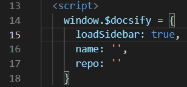
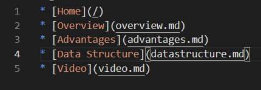

# Data Structure

After completing all of the initial setup for Docsify, the first thing you'll need to do in order to start structuring data is to create a sidebar and Markdown files. Within the index.html file, you'll need to add the following line of code to implement a sidebar. 

Once that has been completed, you will have to create a file called _sidebar.md which will allow you to place as many other Markdown pages within it as you'd like. On this site, I currently have 5 pages total. In the image below, you will be able to see the way in which a site will be structured. 

Through this, you are able to structure the page however you'd like. You can have as many or as little pages as you want, it all depends on the user preference. This is the great thing about Docsify, it only takes a little bit of code to create a very easily accessible and usable site.